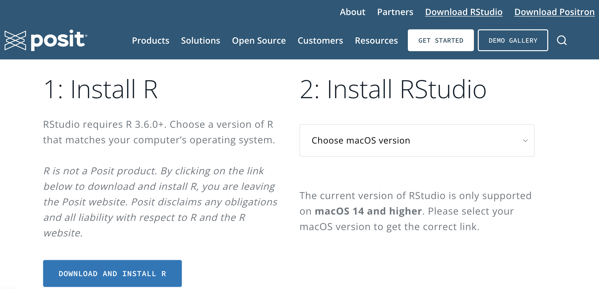
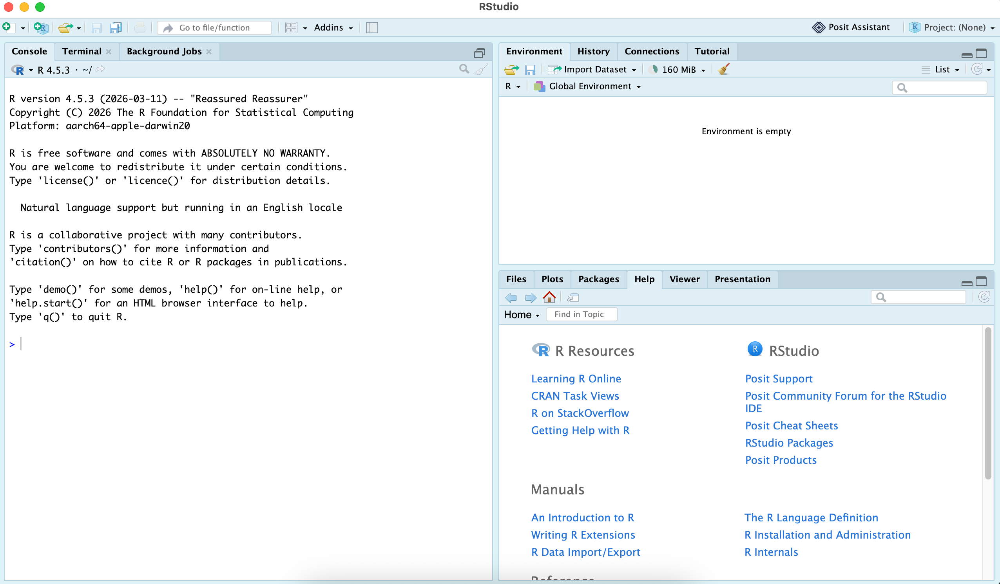
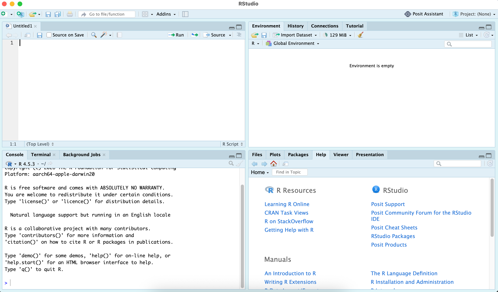
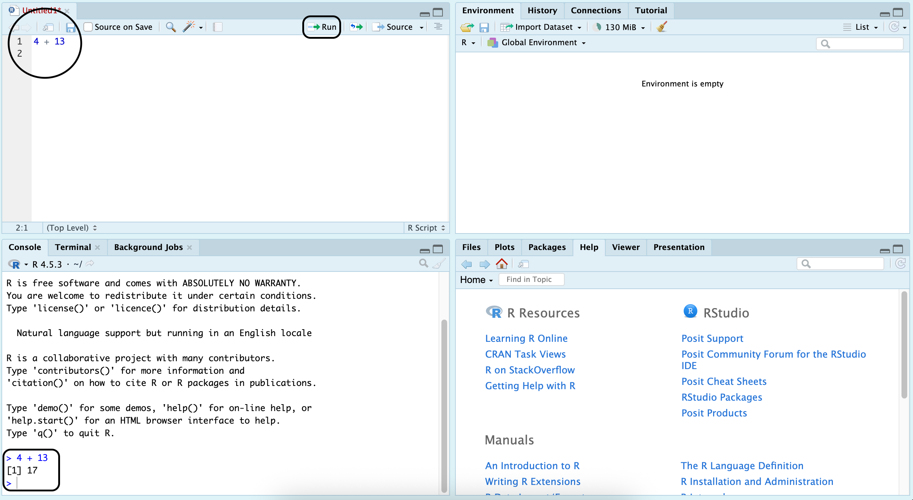
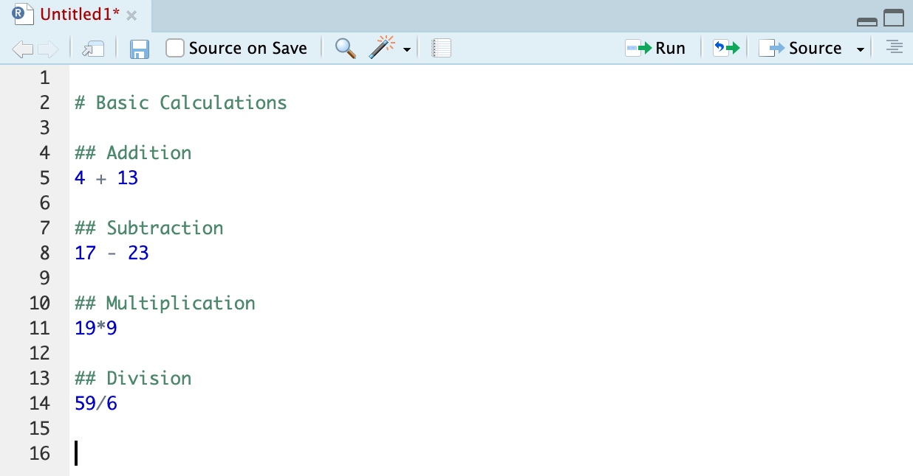
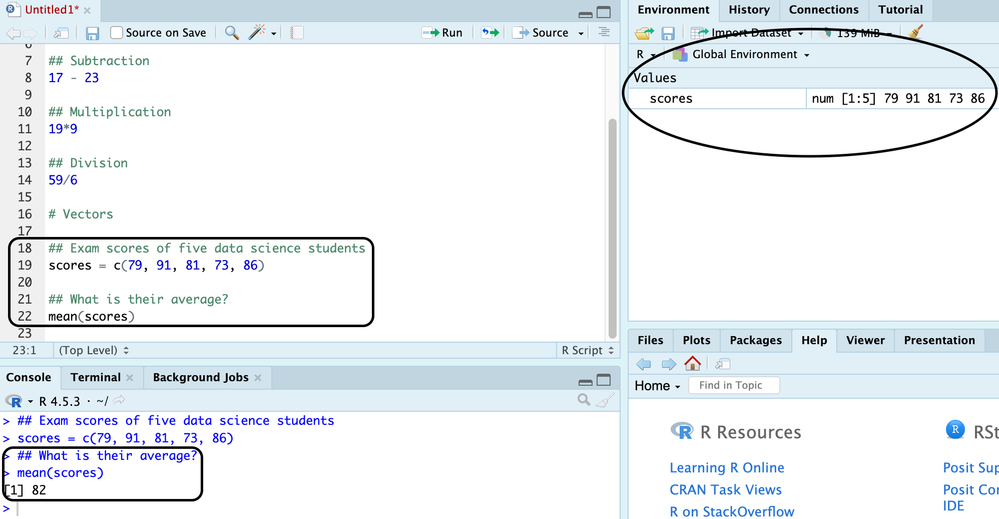
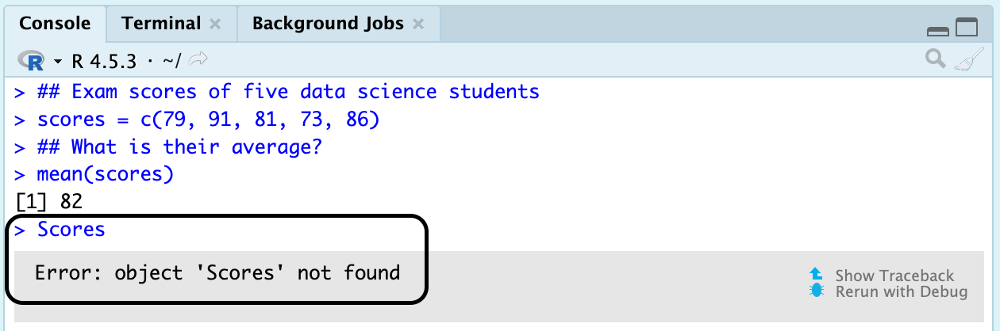

# RStudio and Data

## Our computing tool

### Hello posit {.unnumbered}

As planned, we will use R to carry out all of our calculations. Visit [posit](https://posit.co/download/rstudio-desktop){target="_blank"} to download R and RStudio. When you scroll through that link, you should see those two steps beneath.



It is important that R must be installed first, because RStudio will not work without it. RStudio is what we will be opening and using all the time. It is an IDE (integrated development environment), with organized panes where you can write and execute code as well as navigate files and output. Running code in RStudio initiates R to do its main job, i.e. to perform all of the computational work.

### Launch RStudio {.unnumbered}

After successfully setting up R and RStudio, go to your Windows search bar or Mac's spotlight, type in RStudio then click it. That should launch RStudio and you will see the default IDE with three panes.



### Navigating RStudio {.unnumbered}

That view would suffice if we are only using it as a glorified calculator. As with every topic we would need to do computations, it is ideal that we have a pane where we can create and edit code -- we do that by hitting `control+shift+N` on your keyboard and it will open an untitled script in a new pane called Source.



RStudio has four primary panes:

- The **Source** pane, located top left, allows us to view and edit code-related files (e.g. .R, .rmd, .qmd, .txt).

- The **Console** pane, located bottom left, executes code and displays numerical results.

- The **Environment** pane, located top right, lists currently saved objects (e.g. stored values, imported datasets).

- The **Output** pane, located bottom right, is mainly utilized for managing files, looking at graphs, and browsing documentation of functions and packages through its Help tab.

That is the default pane layout; if along the way, you feel that the Console and Environment panes should switch places or you want the user interface to have a different font, different background color, and all the other aesthetics, the Global Options under Tools can help you make those modifications. The [RStudio IDE User Guide](https://docs.posit.co/ide/user/) has a thorough documentation of such, but for the purposes of keeping it simple, we will stick with the default configuration, except for the tab width (I prefer that it is a width value of 1 -- this can be changed through Tools --\> Global Options --\> Code).

### Basic Computations {.unnumbered}

Ideally, we draft code in the source pane inside an R script (i.e. the Untitled file) and we click Run (`ctrl+enter`) to execute it. The result will appear in the console. While the console can also do this, it often leads to problematic situations as soon as we write multiple lines of code.



It is good practice that coding is all done in a script, rather than the directly in the console. Describing the contents or practically leaving comments in a lengthy code is also an advantage of using a script versus the console. Comments in the script can be made by putting a pound sign (`#`) before the line -- it does not matter how many, as long as there is at least one, it will turn that line into a comment. This improves overall coding documentation as we learn more concepts that require certain packages and functions.



A common data structure that can be created in R is a vector -- a one dimensional collection of values stored in a single object. The concatenate function, `c()`, creates vectors and doing so requires that the elements inside it are separated by commas. In the example below, they were stored in the environment as an object named `scores`. Now every time we type scores or call out scores in a function, it will use that particular vector we saved. Of the many built in R functions, `mean()` is one of them, which in this case was used to obtain the average of their scores.



For demonstration purposes (and as noted earlier), codes can be typed in and executed in the console after hitting enter, but what happened in the scenario below?



Yep, you guessed it right! R is case-sensitive, if we wish to call out `scores` we must type it as how it is spelled. Object names SHOULD always start with a letter and MUST NEVER have a space. Special characters we can use are underscore (`_`) and period (`.`).

<!-- <a href="https://www.google.com/search?q=quarto+square+bullets" target="_blank" rel="noopener"> -->

<!-- Open Google search for Quarto square bullets -->

<!-- </a> -->

### Packages {.unnumbered}

The limitations of R’s default installation are the primary reason packages exist. R packages are collections of functions, datasets, and documentation that extend R’s capabilities by providing additional tools and functionality. Packages are installed from repositories such as [CRAN](https://cran.r-project.org/) using the `install.packages()` function or through RStudio’s interface via *Tools → Install Packages*. Once installed, packages are stored in a library (a directory containing one or more packages) and can be loaded into an R session using the `library()` function.

For guidance, we will demonstrate the uses of a package by following a series of steps.

#### Step 1: New Script {.unnumbered}

On RStudio, create a new script (`CONTROL+SHIFT+N`).

#### Step 2: Install and Load a Package {.unnumbered}

I am a strong advocate of the capabilities of the [`tidyverse` package](https://tidyverse.org/). The syntax involved in writing code blocks in this package appears more intuitive than that of the default.

On your new script, type this down

``` r
install.packages("tidyverse")
```

and press the Run button (`CONTROL+ENTER`). After that, type this in the next line

``` r
library(tidyverse)
```

and run it as well. Some of you might see a bunch of messages, usually stating some conflict and such, just go ahead and ignore that. For some, you might just be lucky and not see any of those messages and see that the console is ready again to execute new code.

#### Step 3: Compare base R and the tidyverse {.unnumbered}

Let's do a mini analysis!

At **PuthPaws Support Operations**, the customer experience team records the **handling time (in minutes)** for a sample of individual customer support tickets received over a short monitoring period.

The values below represent the time required to resolve seven randomly selected tickets (copy the vector below on your script then run it, so it saves in your environment):

``` r
handling = c(12, 15, 9, 20, 18, 14, 16)
```

Each value corresponds to a **single customer support interaction**, measured from ticket creation to resolution.

##### What is the typical handling time? {.unnumbered}

This pertains to the typical value of a dataset. One way to quantify the typical value is to calculate the mean (or average). In the demonstration earlier, we have already shown that R has a bulit-in function `mean` that calculates the average for us.

We can solve for the typical handling time by putting the vector `handling` inside the `mean` function and running the code:

``` r
mean(handling)
```

And we should get this result in the console

``` r
[1] 14.85714
```

That is pretty straightforward but may get clunky as we stack multiple operators and functions.

Another method is by using the pipe operator (`%>%`), which becomes available whenever we load the `tidyverse` package. It allows us to chain multiple lines of code.

As an analog to the computation above, this is how it is done with the pipe operator:

``` r
handling %>% 
 mean()
```

And it should get you the same result. Why do that? Well, it is more intuitive. We can choose to make the output tidier by rounding. If we use the first convention, wrap the `round` function around the `mean` function like this:

``` r
round(mean(handling), 1)
```

The `round` function there takes in two inputs -- the number we are rounding and the number of decimal places we are rounding to (in this case, 1). Imagine how this might become more difficult to understand when we wish to use more functions... but with the pipe operator, all we have to do is pipe the next function to the previous (in a logical way) to get to our desired result:

``` r
handling %>%
 mean() %>%
 round(1)
```

Running that yields

``` r
[1] 14.9
```

While the pipe operator has three symbols, there is no need to worry about pressing way too many keys to encode it because there is a shortcut: `CONTROL+SHIFT+M` -- the keystrokes you will remember and appreciate for the entirety of this textbook.

#### Step 4: Saving a Script {.unnumbered}

Save your script by going to File then clicking Save (it is a .R file), and save it in wherever folder you know you can easily find on your messy laptop.

## Data

### Components of a Dataset {.unnumbered}

### Population vs. Sample {.unnumbered}

### Unit of Analysis {.unnumbered}

```{=html}
<style>

main {
  text-align: justify;
}

</style>
```
